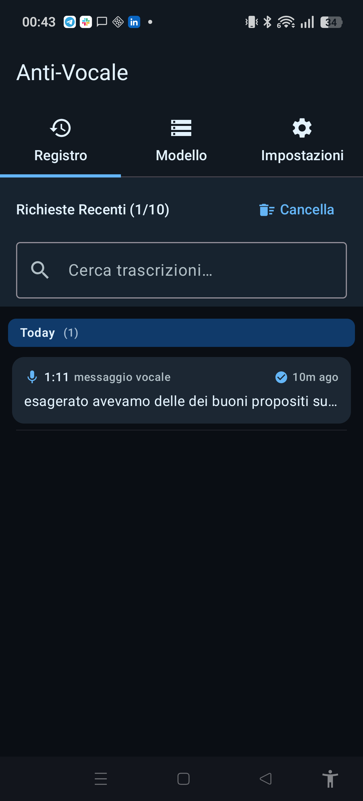
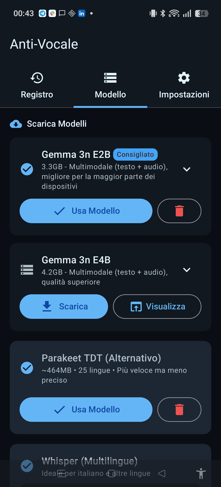
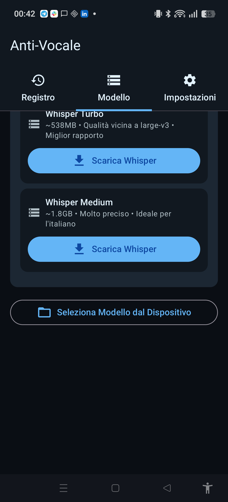
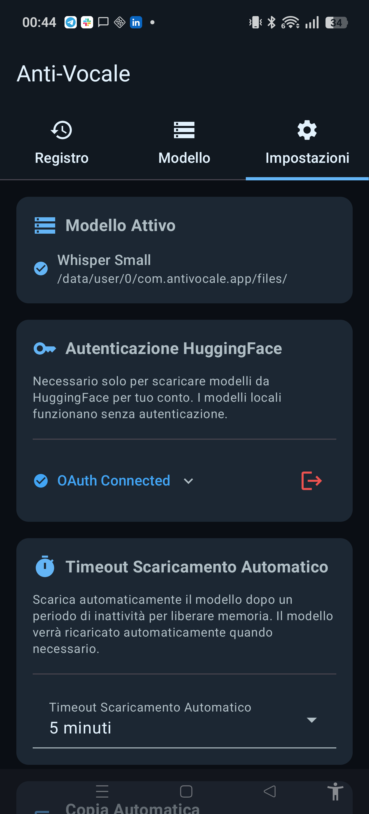
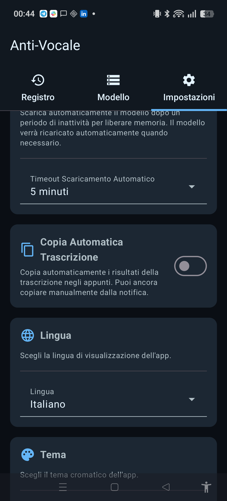
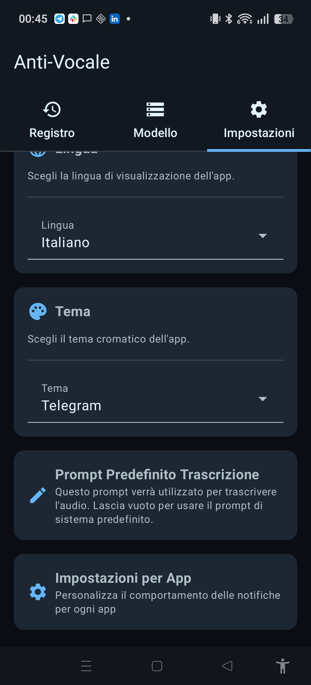
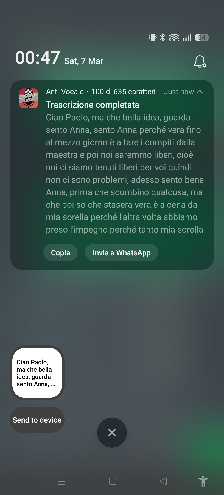

<p align="center">
  <a href="https://play.google.com/store/apps/details?id=com.antivocale.app">
    
  </a>
</p>

# Anti-Vocale

Android app for transcribing voice messages locally on-device, with no internet required.

Anti-Vocale intercepts shared audio files (from WhatsApp, Telegram, etc.), transcribes them using on-device ASR models, and delivers the result via notification with one-tap copy and share-back actions.

## Features

- **Fully offline** - All processing happens on-device, no data leaves your phone
- **Multiple ASR engines** - Choose between Gemma 3n (LLM), Whisper, or Parakeet TDT models
- **Share integration** - Share audio from any messaging app to transcribe
- **Smart notifications** - Copy result or send it back to the source app with one tap
- **Persistent transcription log** - All transcriptions saved to local database with search
- **Queue-aware processing** - Handles multiple concurrent transcription requests with progress tracking
- **Calibration-based ETA** - Progress estimates improve as the model adapts to your device
- **VAD silence stripping** - Optionally strip silent segments before transcription for faster results
- **Configurable inference threads** - Auto-detects or manually sets thread count for performance tuning
- **Per-app settings** - Configure notification behavior per messaging app
- **Multilingual** - App UI in English and Italian; models support 25+ languages
- **Auto-copy** - Optionally copy transcription to clipboard automatically
- **Tasker/automation support** - Trigger transcription via broadcast intents

## Screenshots

### Transcription Log

<p align="center">
  
</p>

### Model Selection

<p align="center">
  
  
</p>

### Settings

<p align="center">
  
  
  
</p>

### Notification with Transcription Result

<p align="center">
  
</p>

## Supported Models

| Model | Type | Size | Languages | Notes |
|-------|------|------|-----------|-------|
| **Gemma 3n E2B** | LLM (multimodal) | 3.3GB | Multi | Recommended, best quality |
| **Gemma 3n E4B** | LLM (multimodal) | 4.2GB | Multi | Higher quality, more RAM |
| **Parakeet TDT 0.6B v3** | ASR (transducer) | 464MB | 25 European | Fast, lightweight |
| **Whisper Small** | ASR (encoder-decoder) | 610MB | 99 | Good balance of speed/accuracy |
| **Whisper Turbo** | ASR (encoder-decoder) | 538MB | 99 | Near large-v3 quality |
| **Whisper Medium** | ASR (encoder-decoder) | 1.8GB | 99 | Best for Italian and other languages |

## Getting Started

### Prerequisites

- Android device with 8GB+ RAM
- Android 8.0 (API 26) or higher

### Install

Download the latest APK from [Releases](../../releases) or build from source:

```bash
./gradlew installDebug
```

See [docs/BUILD.md](docs/BUILD.md) for detailed build instructions.

### First Use

1. Open Anti-Vocale and go to the **Model** tab
2. Download a model (Whisper Small recommended for first-time setup)
3. Go back to your messaging app, long-press a voice message, and share it to Anti-Vocale
4. The transcription appears in a notification with Copy and Share actions

## Architecture

```
Messaging App (WhatsApp/Telegram/...)
    |
    v  [Share Intent]
ShareReceiverActivity
    |
    v
InferenceService (Foreground Service)
    |
    v
AudioPreprocessor (16kHz mono WAV, 30s chunks)
    |
    v
TranscriptionBackendManager
    |--- SherpaOnnxBackend (Parakeet TDT)
    |--- WhisperBackend (Whisper models)
    |--- LlmTranscriptionBackend (Gemma 3n via LiteRT-LM)
    |
    v
Notification (Copy / Send to [App])
```

## Automation

Anti-Vocale can be triggered via broadcast intents for use with Tasker or other automation tools.

```bash
# Transcribe an audio file
adb shell am broadcast \
  -n com.antivocale.app/.receiver.TaskerRequestReceiver \
  -a com.antivocale.app.PROCESS_REQUEST \
  --es request_type "audio" \
  --es file_path "/sdcard/Download/voice_message.ogg" \
  --es task_id "transcribe_$(date +%s)"

# Preload model into memory
adb shell am broadcast -a com.antivocale.app.PRELOAD_MODEL
```

See [docs/TASKER_GUIDE.md](docs/TASKER_GUIDE.md) for detailed automation setup.

## License

See [LICENSE](LICENSE) for details.
