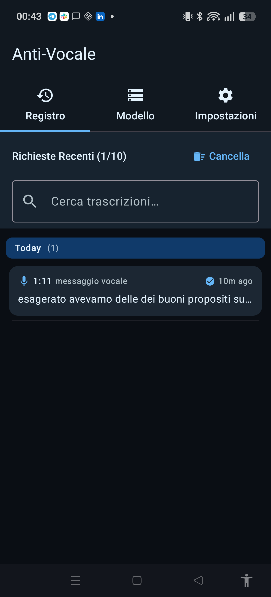
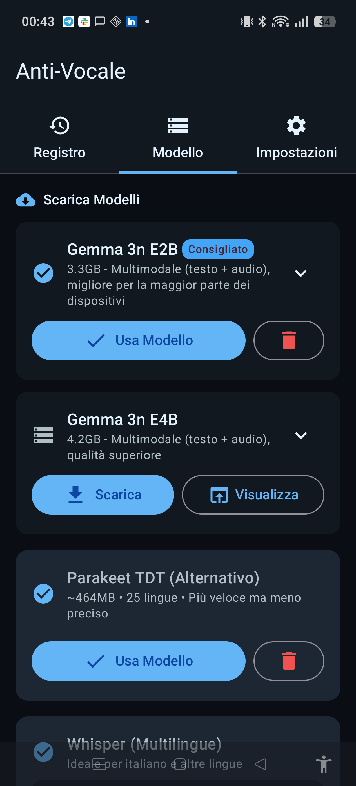
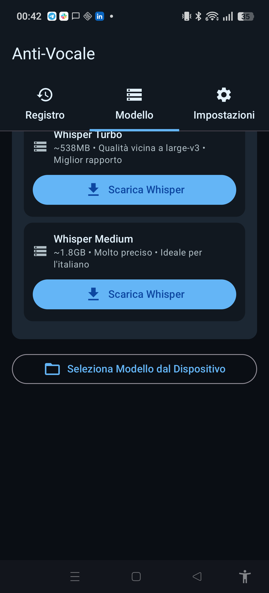
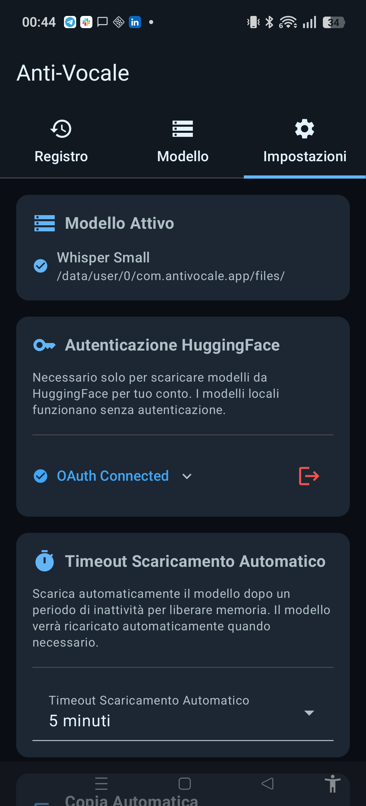
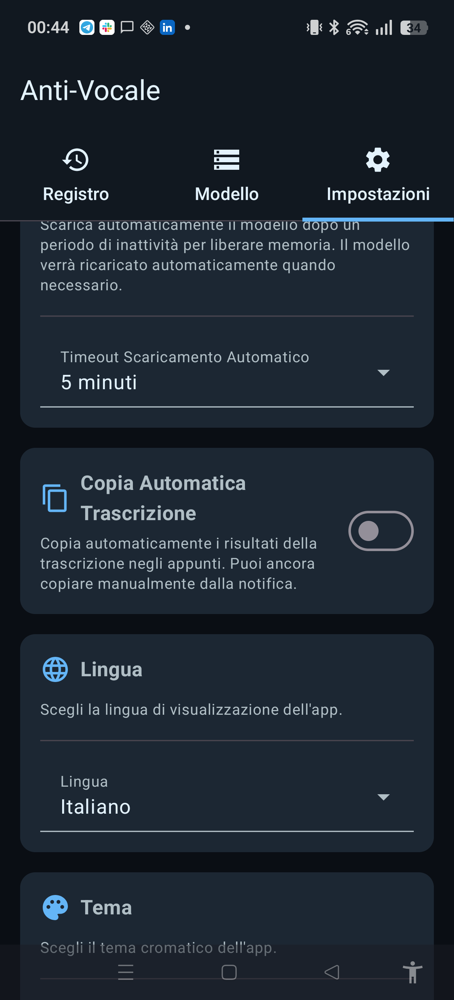
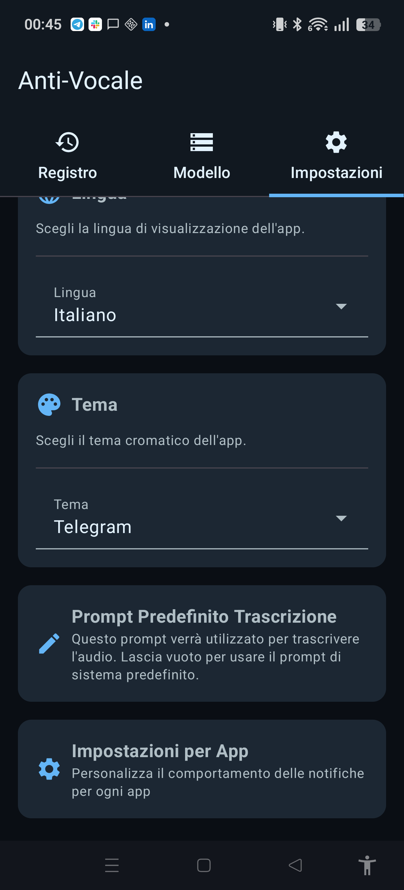

<p align="center">
  <a href="https://f-droid.org/packages/com.antivocale.app/">
    
  </a>
  &nbsp;
  <a href="https://play.google.com/store/apps/details?id=com.antivocale.app">
    
  </a>
</p>

<p align="center">
  
</p>

# Anti-Vocale

Android app for transcribing voice messages locally on-device, with no internet required.

Anti-Vocale intercepts shared audio files (from WhatsApp, Telegram, etc.), transcribes them using on-device ASR models, and delivers the result via notification with one-tap copy and share-back actions.

## Why this app exists

The big messengers transcribe voice messages only partially, or not at all:

- **WhatsApp on Android** officially transcribes just English, Portuguese, Spanish, and Russian. Italian is supported on iPhone but is not supported on Android.
- **Telegram** runs transcription on its own servers and reserves it for paid Premium subscribers; free accounts get at most a small weekly trial quota that Telegram itself can dial down to nothing.
- **Signal** ships no voice transcription at all.

Anti-Vocale closes that gap with a different trade-off. It runs entirely on your phone, so audio never leaves the device, whatever chat it came from. It works with every messaging app through the standard Android share sheet, not just one platform. It is free. And it transcribes any language the installed models cover, including community fine-tunes imported from the model catalog, so coverage is not decided by a platform vendor.

## How this project is built

Anti-Vocale is developed with heavy AI assistance and human ownership: a coding agent executes, the maintainer designs, reviews, and owns every change, and one human signs every release. The badge above says it plainly: AI-assisted, human-owned.

This is a deliberate choice, not a shortcut. The compatibility space this app lives in is a matrix of devices, inference backends, models, and per-language quality, and it is too vast to validate the way a narrower domain could. Published WER numbers almost never match real-phone experience: they are typically measured on full-precision models running on desktops, before quantization and before vendor-specific Android quirks. That complexity is exactly why the project is only sustainable with heavy AI-assisted development plus feedback from the community on real devices.

What keeps that honest is the verification bar: every code change passes the automated test suite, and behavior changes are verified on a real device before release; the measurements and device logs behind the fixes are public in the issues. Much of the day-to-day development happens over chat from a phone, sometimes while walking down the street: decisions land where life happens, and the verification pipeline is what makes that safe. If you want to contribute, [CONTRIBUTING.md](CONTRIBUTING.md) says what we ask of AI-assisted contributions.

## Model catalog

Everything the app can transcribe with, on one page: bundled models with sizes, languages, speed notes, and the community imports, each linked back to the original model it comes from. See [docs/model-catalog.md](docs/model-catalog.md).

## Features

### Privacy & offline first

- **Fully offline** - All processing happens on-device, no data leaves your phone
- **Local history** - Every transcription is saved to an on-device database with full-text search; nothing is uploaded

### Models

- **Multiple ASR engines** - Choose between Gemma (LLM), Whisper, Parakeet TDT, Qwen3-ASR, GigaAM v3, Nemotron 3.5 (streaming), or import your own
- **Custom model import** - Bring any sherpa-onnx model (transducer, Whisper, CTC, SenseVoice) from a folder or HuggingFace URL, no app update needed; one-tap validated entries live in the community catalog, and only models matching a supported family's layout import ([docs](docs/external-models.md#what-import-is-for-and-what-it-does-not-promise))
- **Full user manual** - Getting started, choosing a model, troubleshooting and FAQ, in 8 languages ([user guide](docs/user-guide/))
- **Any audio length** - Long inputs are automatically split and stitched: no model's internal limit is user-facing (see the [FAQ](FAQ.md))
- **Declared limits before download** - Each model card states its audio-length capability up front, so big downloads are informed choices
- **Model benchmarking** - Compare real-world transcription speed between models on your own device

### Transcription pipeline

- **Queue-aware processing** - Concurrent requests queue up visibly (Queued → Processing → Done) and complete in order
- **Progressive display** - Text appears segment-by-segment instead of waiting for the full result
- **VAD silence stripping** - Optionally strip silent segments before transcription for faster results (boundaries fall on natural speech gaps)
- **Confidence indicator** - Shows detected language and warns about low-confidence results
- **Video file support** - Transcribe audio from video files; extract embedded subtitles
- **Calibration-based ETA** - Progress estimates improve as the model adapts to your device

### Results & history

- **Smart notifications** - Read long transcripts page-by-page without leaving the shade, copy the full result, or send it back to the source app with one tap
- **Re-transcribe** - Retry any transcription with a different model straight from the history
- **History actions** - Swipe or long-press any entry for copy, re-transcribe, and delete
- **Per-entry metadata** - Each entry shows which model produced it and how long it took
- **Auto-copy** - Optionally copy transcription to clipboard automatically
- **Save to folder** - Auto-save transcripts as .txt to a folder of your choice (Drive, Syncthing, Dropbox, etc.)
- **Picture-in-Picture** - See live transcription in a floating window while using other apps

### Integration & automation

- **Share integration** - Share audio from any messaging app to transcribe
- **Model-specific share targets** - Pick a specific model directly from the Android share sheet
- **Tasker/automation support** - Trigger transcription via broadcast intents
- **HuggingFace login** - Authenticate (token or OAuth) for gated model downloads

### Performance & appearance

- **Configurable inference threads** - Auto-detects or manually sets thread count; NNAPI and CPU providers selectable
- **Performance stats** - Track real-world transcription speed per model on your device
- **Theming** - Three color palettes (Indigo, WhatsApp, Telegram) with light and dark modes
- **Multilingual UI** - Interface translated in English, Italian, German, Spanish, French, Portuguese (BR), Russian, and Hindi
- **Per-app settings** - Configure notification behavior per messaging app
- **Organized settings** - Grouped into Transcription, Appearance, and Advanced sections

## Screenshots

### Transcription Log

<p align="center">
  
</p>

### Model Selection

<p align="center">
  
  
</p>

### Settings

<p align="center">
  
  
  
</p>

### Notification with Paged Transcription Result

Long transcripts are split into pages you can read without leaving the notification shade: the arrows move back and forward, Copy always grabs the full text, and one-tap send-back to the source app stays one page away.

<p align="center">
  
  
  
</p>

### Themes

<p align="center">
  
  
  
</p>

## Supported Models

### LLM (Multimodal)

| Model | Size | Notes |
|-------|------|-------|
| **Gemma 4 E2B** | 2.6GB | Recommended, newest generation, best for most devices |
| **Gemma 4 E4B** | 3.7GB | Newest generation, higher quality |
| **Gemma 3n E2B** | 3.3GB | Previous generation |
| **Gemma 3n E4B** | 4.2GB | Previous generation |

### ASR (Encoder-Decoder)

| Model | Size | Languages | Notes |
|-------|------|-----------|-------|
| **Whisper Small** | ~358MB | 99 | Only for low-spec devices |
| **Whisper Turbo** | ~988MB | 99 | Near large-v3 quality, best value |
| **Whisper Medium** | ~903MB | 99 | Best for Italian and other languages |
| **Distil Italian** | ~939MB | Italian | Fastest Whisper variant, optimized for Italian |

### ASR (Transducer)

| Model | Size | Languages | Notes |
|-------|------|-----------|-------|
| **Parakeet TDT SmoothQuant** | ~862MB | 25 European | Best overall quality, recommended default (inputs over 1 minute are chunked and stitched, sized to free RAM; see [FAQ](FAQ.md)) |
| **Parakeet TDT Stock int8** | ~640MB | 25 European | Lighter fallback, best speed/size ratio |
| **GigaAM v3** | ~326MB | Russian | Best Russian accuracy, native punctuation |
| **Qwen3-ASR 0.6B** | ~938MB | 30 + 22 zh | 30 languages + 22 Chinese dialects; poor Italian accuracy |

### Custom Models (ONNX Sherpa)

Import any sherpa-onnx transducer model from a local folder or HuggingFace URL. The app handles role-based file matching (encoder/decoder/joiner/tokens), SHA-256 verification, and architecture selection. See the [import reference](docs/external-models.md) for supported formats and the catalog-entry JSON schema.

### Italian ASR Benchmark

[Full 4-model comparison](scripts/benchmark/README.md) on 8 Italian FLEURS samples (101.6s audio):

| Model | WER | Speed | Size |
|-------|-----|-------|------|
| **Distil Large V3 IT** | **4.3%** | 0.723x | 939MB |
| **Parakeet TDT** | 5.4% | **0.041x** | **640MB** |
| Whisper Turbo | 6.3% | 1.217x | 990MB |
| Qwen3-ASR 0.6B | 12.2% | 0.278x | 954MB |

### ASR (Streaming)

| Model | Size | Languages | Notes |
|-------|------|-----------|-------|
| **Nemotron 3.5** | ~640MB | 40+ | Cache-aware streaming transducer, auto-detect + native punctuation/casing |
| **Qwen3-ASR 0.6B** | ~938MB | 30 + 22 zh | Streaming-capable; poor Italian accuracy |

### Build Flavors

| Flavor | Firebase | Use case |
|--------|----------|----------|
| **playStore** | Crashlytics + Analytics | Google Play distribution |
| **fdroid** | None | F-Droid / FOSS distribution |

Both flavors share the same `applicationId` and feature set. The only difference is crash reporting (Firebase vs logcat-only).

## Getting Started

Common questions (model limits, chunking, queue behavior, where to find transcription metadata) are answered in the [FAQ](FAQ.md).

### Prerequisites

- Android device with 4GB+ RAM
- Android 8.0 (API 26) or higher
- 500MB+ free storage (model size varies, up to 4.2GB for Gemma 3n E4B / 3.7GB for Gemma 4 E4B)

### Install

**Play Store:** [Get it on Google Play](https://play.google.com/store/apps/details?id=com.antivocale.app)

**F-Droid:** [Get it on F-Droid](https://f-droid.org/packages/com.antivocale.app/)

**GitHub Releases:** Download the APK from [Releases](../../releases)

Or build from source:

```bash
./scripts/fetch-sherpa-aar.sh   # one-time: download the sherpa-onnx AAR (not committed)
./scripts/install.sh
```

See [docs/BUILD.md](docs/BUILD.md) for detailed build instructions.

### First Use

1. Open Anti-Vocale and go to the **Model** tab
2. Download a model (Parakeet TDT recommended: fast multilingual, good quality/size ratio)
3. Go back to your messaging app, long-press a voice message, and share it to Anti-Vocale
4. The transcription appears in a notification with Copy and Share actions

## Architecture

```
Messaging App (WhatsApp/Telegram/...)
    |
    v  [Share Intent]
ShareReceiverActivity / ShareTargetManager (model-specific aliases)
    |
    v
InferenceService (Foreground Service)
    |
    v
AudioPreprocessor (16kHz mono WAV, 30s chunks)
    |
    v
TranscriptionOrchestrator
    |--- SherpaBackend (one engine; bundled catalog entries: Parakeet TDT, Whisper, Qwen3-ASR, GigaAM v3, Nemotron 3.5 streaming)
    |--- ExternalSherpaBackend (user-imported models: Transducer/Whisper/CTC/SenseVoice)
    |--- LlmTranscriptionBackend (Gemma via LiteRT-LM)
    |
    v
Notification (Paging / Copy / Send to [App]) + Confidence Indicator
```

## Automation

Anti-Vocale can be triggered via broadcast intents for use with Tasker or other automation tools.

```bash
# Transcribe an audio file
adb shell am broadcast \
  -n com.antivocale.app/.receiver.TaskerRequestReceiver \
  -a com.antivocale.app.PROCESS_REQUEST \
  --es request_type "audio" \
  --es file_path "/sdcard/Download/voice_message.ogg" \
  --es task_id "transcribe_$(date +%s)"

# Preload model into memory
adb shell am broadcast -a com.antivocale.app.PRELOAD_MODEL
```

See [docs/TASKER_GUIDE.md](docs/TASKER_GUIDE.md) for detailed automation setup.

## License

See [LICENSE](LICENSE) for details.
