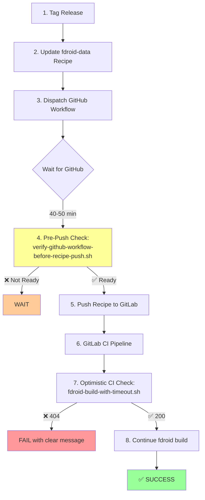

# F-Droid Release Guarded Flow (Correct Sequence)

This diagram shows the correct order with explicit synchronization points to prevent the race condition.

## Correct Sequence with Guards



## Guard Points Explained

### Guard 1: Pre-Push Check (Developer Machine)
**Script:** `verify-github-workflow-before-recipe-push.sh`  
**When:** After GitHub workflow dispatched, BEFORE pushing recipe  
**Purpose:** Block push until reproducible job completes  
**Behavior:**
- ✅ Pass: Workflow completed, APKs verified → allows push
- ❌ Fail: Workflow still running → blocks with "wait 20-30 min" message

### Guard 2: Optimistic CI Check (GitLab Pipeline)
**Script:** `fdroid-build-with-timeout.sh`  
**When:** At start of fdroid build job  
**Purpose:** Fast-fail if artifacts not ready  
**Behavior:**
- ✅ Pass: All URLs return 200 in <5s → continues build
- ❌ Fail: Any URL returns 404 in <5s → fails fast with clear message

## Timing Breakdown

| Phase | Duration | Async? | Guard Check |
|-------|----------|--------|-------------|
| Release prep | ~5 min | ❌ Sync | None |
| GitHub workflow | 40-50 min | ✅ Async | Guard 1: Pre-push |
| GitLab CI | 10-15 min | ✅ Async | Guard 2: Optimistic |

**Key insight:** The async/parallel execution is intentional for efficiency, but needs explicit synchronization points (the guards) to prevent race conditions.

## Failure Modes Prevented

### Before Guards (Current State)
```
Developer pushes recipe
  ↓ (immediate CI trigger)
GitLab tries download → 404 → FAIL
  ↓ (parallel, unaware)
GitHub still building (wasted 40 min)
```

### After Guards (Proposed)
```
Developer tries to push recipe
  ↓
Guard 1: Workflow not ready → BLOCK
  ↓ (wait 20-30 min)
GitHub completes
  ↓
Developer pushes recipe
  ↓
GitLab CI starts
  ↓
Guard 2: Optimistic check → 200 ✅
  ↓
Build continues → SUCCESS
```

## Implementation Status

- [ ] Phase 1: Create pre-push check script
- [ ] Phase 2: Create CI guard script
- [ ] Phase 3: Update runbook with guard steps
- [ ] Phase 4: Test both guards end-to-end

## Related Documents

- Incident analysis: `docs/research/fdroid-pipeline-race-condition-2026-08-31.md`
- Full proposal: `docs/research/fdroid-release-guard-proposal.md`
- Current runbook: `docs/release-runbook.md`
