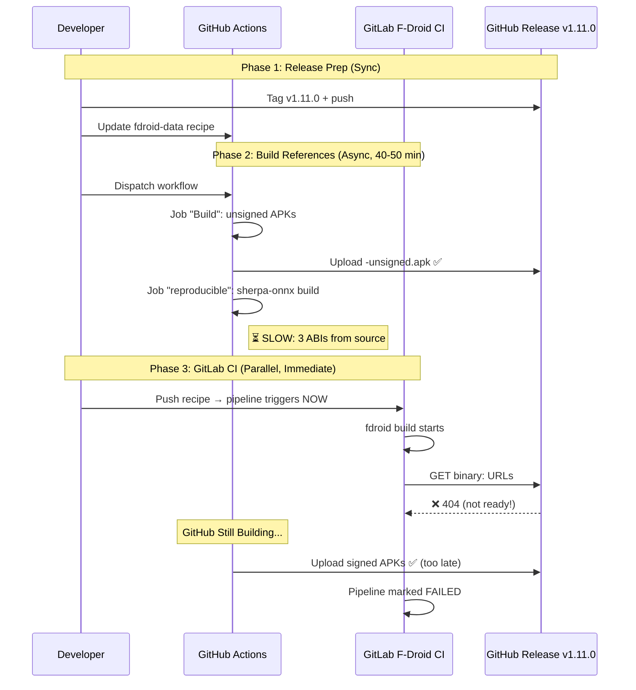

# F-Droid Pipeline Race Condition Incident

**Date**: 2026-08-31  
**Severity**: High (release blocker)  
**Status**: Open; fix implemented locally (NDK map + guards), pending maintainer review and re-dispatch  
**Affected**: F-Droid release v1.11.0 pipeline

## Problem Statement

The F-Droid GitLab CI pipeline failed with HTTP 404 errors when attempting to download reference APKs from GitHub Releases, despite the release existing and the recipe being correctly formatted.

## Root Cause Analysis

### Timeline of Events

```
08:35  GitHub workflow android-release.yml dispatched (tag: v1.11.0)
08:40  Job "Build" completed → uploaded -unsigned.apk artifacts ✅
08:35  GitLab pipeline triggered by recipe push (parallel!)
08:46  GitLab fdroid build job → binary: URL checks → ❌ 404 Not Found
08:50+  GitHub job "reproducible" STILL RUNNING (compiling sherpa-onnx)
```

### The Race Condition

```
Fast Path: GitLab CI trigger (immediate, ~1 min)
Slow Path: GitHub Actions reproducible build (40-50 min)

Gap: ~4 minutes between recipe push and GitLab download attempt
Required: ~45 minutes for sherpa-onnx compilation from source
Result: GitLab tries to download non-existent artifacts
```

### Technical Details

**GitLab CI Error:**
```
ERROR: Could not build app com.antivocale.app: Downloading Binaries from
https://github.com/RisorseArtificiali/anti-vocale/releases/download/v1.11.0/app-fdroid-armeabi-v7a-release.apk failed.

HTTP/1.1 404 Not Found
```

**Why 404?**  
The GitHub release v1.11.0 contained:
- ✅ `app-fdroid-armeabi-v7a-release-unsigned.apk` (uploaded by "Build" job)
- ❌ `app-fdroid-armeabi-v7a-release.apk` (created by "reproducible" job - STILL RUNNING)

**F-Droid Requirements:**
- Recipe `binary:` field points to SIGNED APKs (`*-release.apk`, no `-unsigned`)
- F-Droid downloads these for reproducibility verification
- Unsigned APKs are required (F-Droid resigns with its own key)

## Why This Happened

The release runbook (docs/release-runbook.md) documents:
- Step 4: Update F-Droid recipe **BEFORE** building references
- Step 5: Build reference APKs via GitHub workflow
- Step 6: Verify binary URLs resolve

But the runbook assumes Step 5 completes **before** the pipeline from Step 4 runs. In reality:
1. Recipe push → GitLab CI triggers **immediately**
2. GitHub workflow takes 40-50 minutes to complete
3. No documented guard for "wait for GitHub" before GitLab runs

## Sequence Diagram

See diagram: `docs/diagrams/fdroid-release-sequence.mmd` (rendered below)



## Resolution

### Immediate Fix

Wait for GitHub job 33373597736 to complete (~25-35 min remaining), then:
1. Verify signed APKs exist in release
2. Re-trigger GitLab pipeline (or it auto-retries)
3. Pipeline should pass (binary URLs resolve)

### Additional Issue Discovered During Investigation

**Problem #2: GitHub reproducible job failed (NDK pin + GitLab 503)**

After waiting for workflow 33373597736, the `reproducible-fdroid` job ended in
`failure`. Two errors in its log, both distinct from the race condition above:

1. **NDK pin mismatch in the new 1.11.0 build blocks** (structural):
   ```
   WARNING: Android NDK version 'r28c' could not be found!
   ERROR: Could not build app com.antivocale.app: fdroidserver.exception
   ```
   The three 1.11.0 blocks declare `ndk: r28c` while every earlier build uses
   `ndk: r27c`, and their own prebuild still runs `sdkmanager 'ndk;r27c'`. The
   GitLab buildserver image happens to carry both NDKs so the fdroiddata CI
   survived, but the GitHub reference container does not resolve r28c, so the
   reference build of versionCodes 382/384 aborted. The guard then refused to
   sign: `ERROR: no directory contains the full newest version (381 382 384);
   refusing to sign stale APKs`.

2. **Transient GitLab 503 during srclib fetch** (08:48, network):
   ```
   ERROR: VCS error while building app com.antivocale.app: Git fetch failed
   fatal: unable to access 'https://gitlab.com/fdroid/reproducible-apk-tools.git/': ... 503
   ```

An earlier hypothesis recorded here ("mirror not synchronized") was WRONG and
has been retracted after fetching the mirror's recipe: `av1100-slim` at HEAD
does carry the three 1.11.0 blocks with the correct commit. The guard failure
was about missing build OUTPUTS (382/384 never built), not a stale recipe.

**Fix required before re-running the workflow**:
1. Align the NDK pin: either `ndk: r27c` in the three 1.11.0 blocks (matches
   all earlier builds, the prebuild's sdkmanager line, and the app's
   `ndkVersion 27.0.12077973`), or make r28c available in the reference
   container. The r27c alignment is the smallest change.
2. Push the corrected recipe to BOTH the fork and the mirror (av1100-slim).
3. Delete the six stale `app-fdroid-*` release assets (runbook stale-asset
   rule) and re-dispatch `android-release.yml`.
4. Only then re-trigger the GitLab pipeline (the race condition fix: the
   signed assets must exist first).

### Long-term Fix Required

See proposal: `docs/research/fdroid-release-guard-proposal.md` (created below)

## Prevention

**For future releases:**
1. **Pre-flight check**: Verify GitHub workflow completed before pushing recipe
2. **Guard in CI**: Add explicit artifact existence check with timeout
3. **Documentation**: Update runbook with explicit timing expectations

## References

- GitLab pipeline: https://gitlab.com/paoloantinori/fdroid-data/-/pipelines/2804806404
- GitHub workflow: https://github.com/RisorseArtificiali/anti-vocale/actions/runs/33373597736
- Runbook: docs/release-runbook.md (Steps 4-6)
- Related: TASK-420 (cross-check tooling)

## Lessons Learned

1. **Silent failures**: Pipeline fails fast with 404, but root cause is timing, not code
2. **Parallel pitfalls**: Async long-running tasks need explicit synchronization points
3. **Documentation gaps**: Runbook describes phases but not inter-phase dependencies
4. **Monitoring gaps**: No automated alert when workflow vs pipeline timing mismatch occurs
